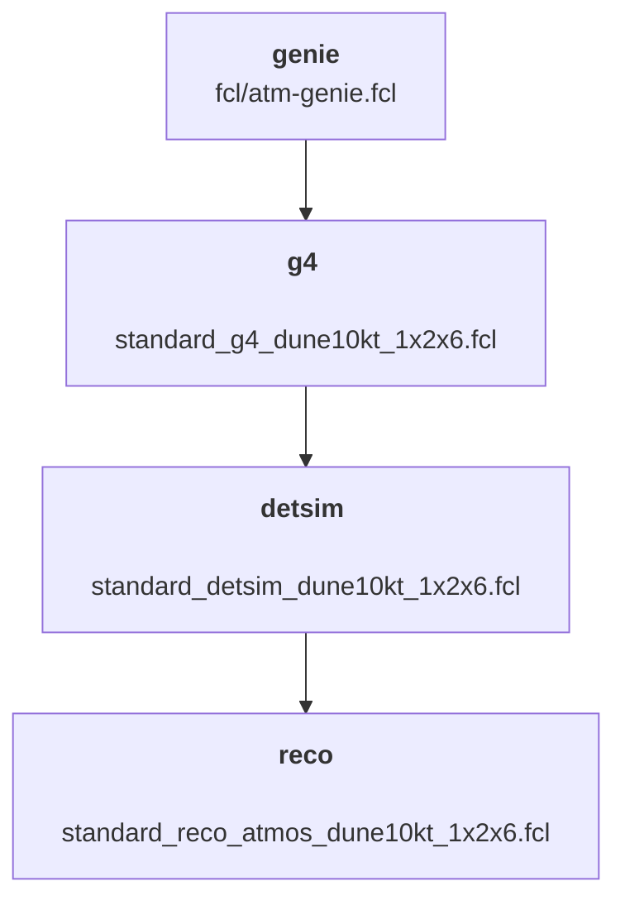

# Set of scripts to make an atm. nu generation

This repo contains the scripts that I use for atmospherics neutrino sample generation. Here is a short description of the various folders:

- `utils`: Contains some scripts used to ease the job submission
- `fcl`: Contains the handwritten FCL files that are not generic
- `scripts`: Contains the scripts to be executed by the jobs at the various steps
- `json`: Contains the json configuration files used to launch a set of jobs with a specific configuration. To be used with `utils/json_submit`

## Generation steps

The atmospherics sample generation is made in 4 steps:



Each step has to be applied successively by using `utils/json_submit` on the associated json files found in `json`.
Of course some parameters have to be changed if you want to run this by yourself. For example `GLOBAL_ODIR` can be easily changed in all the scripts files by using:
```bash
sed -i 's#^GLOBAL_ODIR.*#GLOBAL_ODIR="/pnfs/dune/scratch/users/MY_USERNAME/MY_SAMPLE_NAME/"#g' scripts/*.sh
```

NB: Not working at the moment as LArSoft v09_74_01 has been released but not dunesw v09_74_01 yet!