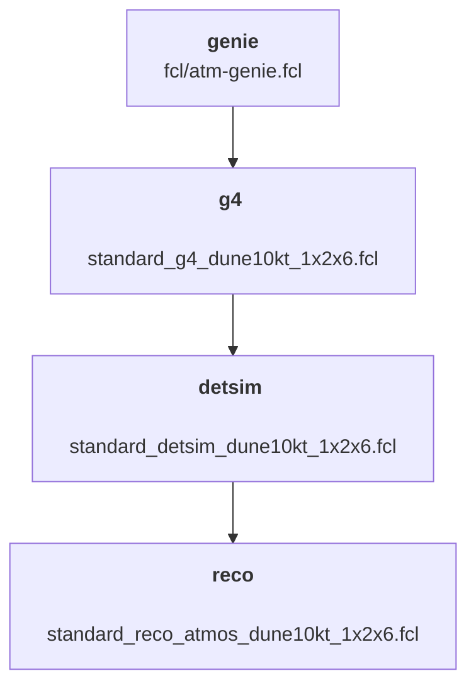

[[_TOC_]]

# Set of scripts to make an atm. nu generation

This repo contains the scripts that I use for atmospherics neutrino sample generation. It contains both atmospheric specific FCL files but also generic utils that can be used for any LArSoft generation in theory. All was designed to be used on **FNAL machines**. Here is a short description of the various folders:

- `utils`: Contains some scripts used to ease the job submission
- `fcl`: Contains the handwritten FCL files that are not generic
- `scripts`: Contains the scripts to be executed by the jobs at the various steps. Now only contains one master bash script that is automatically configures and can be used to run all the different stages of the simulation.
- `json`: **Deprecated (left for the record)** ~~Contains the json configuration files used to launch a set of jobs with a specific configuration. To be used with `utils/json_submit`.~~

## Setup instructions one dunegpvms

Following these instructions should allow for a clean python env that ensures the good behaviour of the scripts of this repo. You might be able to install the requirements without this but we were not able to reproduce it in a consistent manner...

### To create an environment

To be executed at the root of this repo

```bash
setup python v3_9_13
python3 -m venv my_venv
source my_venv/bin/activate
pip install -U pip
pip install -r requirements.txt
```

### To use this environment

Commands to be run each time you start a new terminal and want to use these scripts to load the right python environment. I would advise you to use tmux (or screen if you are very old) to keep a session open with this specific env from which you can start new jobs at anytime.

```bash
setup python v3_9_13
source my_venv/bin/activate
```

## Production submission script
The script `utils/chain-submit.py` allows to send jobs for a whole simulation path can be defined in a yaml file. This python code is the main one to be executed to be able to make a sample production. It should be called using `python3 utils/chain-submit.py OPTIONS`. It is used to run the same chain of simulation scripts on multiple files containing a given number of events by sending jobs to the grid.

Here is how this script works:

1. A yaml configuration file describing the sample production is provided (explicit configuration described later).
2. The script builds a representation of the sample production steps in a chained way.
3. Output files are looked for in the relevant output folders to assess which files are available for each step and deduce what are the next jobs to send with a ready input; no output; and no already running job for this file and step.
4. For each step, the jobs that can be started (meeting the previously described criteria) are sent to the grid using the `jobsub_submit` script available an Fermilab.
5. The jobid of each job is saved inside a local database to detect jobs that ended without providing an output file to be able to restart them (managed at step 3.).

The script does not provide an internal loop at the moment. The best way to use it is thus to execute a loop such as (**in a tmux session OFC**):
`while True; do python3 utils/chain-submit.py; sleep 15m; done`

### `chain-submit.py` options

```
usage: chain-submit.py [-h] [--skip-ok] [--steps [STEPS [STEPS ...]]]
                       path_file {send,clear,dry,rebuild_db,new}

Restarts failed jobs

positional arguments:
  path_file
  {send,clear,dry,rebuild_db,new}

optional arguments:
  -h, --help            show this help message and exit
  --skip-ok             Doesn't print the lines when all the files are
                        available for a specific id
  --steps [STEPS [STEPS ...]]
                        List of steps on which to apply the given action
```

The script has to be executed with one of these available options:
- **path_file**: Is your Yaml configuration file with path
- **send** : Used to actually send the jobs. This is the main command to use when you are sure of what you are going to run.
- **clear** : Used to clear the temporary files that indicate that jobs are running. Was useful to deal with failed jobs manually. Should not be necessary anymore as the failed jobs are automatically dealt with now.
- **dry** : Simulates a job sending **without actually doing it**. Is very useful to test what will be executed by the code without actually doing anything.
- **rebuild_db** : Is used to recompute the file/step <--> jobid db association. Should not be used in normal operations.
- **new** : Automatically created the output tree structure for the sample to be produced.

Two optional arguments can also be provided:

- **--skip-ok**: to only print output for the non-complete subsamples.
- **--steps**: allows to provide a list of steps on which the operations should be applied. By default all the steps of the simulation chain are executed. Can be useful to takeover from a previous generation into a new output folder.


### Yaml configuration file

The main item of the yaml config file is the `path` that describes the simulation path with the chain of all the simulation that have to be run in order to complete the full simulation chain. An example used for the atmospheric sample production is provided in this repository in `sim_hd_VD.yaml` for example.

The path is composed of a list of steps that are automatically chained together. Each step always depends on the output of the previous one. The following fields can be specified for each step:

- **name** : the step name used for display and for specify specific steps to use in `chain-submit.py` arguments
- **idir** : refers to the input directory from which the input files are taken. When not specified, it is automatically chained with the `odir` directory of the previous step.
- **ifile** : Indicates the input filename basename that will be appended with `_$JOBID.root`. Once again, it is automaticaly chained with the previous step `ofile` pattern when not specified.
- **odir** : refers to the directory in which to store the output files for this step. **As far as I know, the output directory can only be set to some place on the FNAL scratch area (), please do this. Note that the files there have a lifetime of ~1 month so COPY THEM TO PERSISTENT REALLY FAST AFTER THE GENERATION ENDED!**
- **ofile** : indicated the output file pattern that will be appended with `_$JOBID.root`.
- **subdir** : if specified, it is appended to the `odir` path. This is expected to be used by setting a global `odir` and then only specifying individual `subdir` for each simulation step.
- **fcl** : indicates the fcl file that has to be used for this step. The fcl file can either be a generic one available in the LArSoft installation or a local fcl file that will be copied over when submitting the job.
- **local_source** : allows to specify a user installation of LArSoft with user-defined sources under the form of a `.tar.gz` archive file. The tool `utils/gen_tar.sh` is provided in order to easily generate this archive with the sources. It just needs to be executed with the local sources setup in the environment. The archive has to be recreated each time the user sources are modified and/or recompiled for the changes to be taken into account.
- **dune_version** : field used to specify the larsoft version to use for this generation stage. Should also be specified even when using local sources (make sure to pick the same version as the one used to setup these local sources)
- **dune_qual** : specifies the dune qualifier to use together with the `dune_version`
- **outputs** : a list of outputs to be copied back at the end of the job execution. This should be used to retrieve files produced by LArSoft that are not the official LArSoft output such as `flatcaf.root` for example.
- **inputs** : a list of inputs to be copied in the directory where the LArSoft job is executed. Is typically used for `xml` pandora config files that configure the reco job.
- **job_config** : a dictionnary of keys to pass to the job submission. The list of relevant fields can be found in `jobsub_submit` documentation. 
- **is_larsoft** : indicates that the jobs sent will be Larsoft jobs and toggles some checks on the presence of some LarSoft-specific parameters. Should be set to `False` if you are not sending a LArSoft job. Defaults to `True`.
- **script** : indicates which script to use to run the job on the remote node. The default one is to run any LArSoft job and should fit most of your needs.
- **env** : dictionnary of env variables to be passed to the script when it is running. Should mainly be used when using non-LArSoft jobs to specify the relevant parameters to the job.
- **repeat** : Shortcut to repeat the same step multiple times with each one taking as input the output of the previous iteration. Was mainly thought to be used for MaCh3 chains generation. Defaults to 1, meaning a single iteration of each step.
- **dataset** : Dataset definition to use as input of the job. Replaces `ifile`, both cannot be set at the same time.
- **debug_output** : If `True` set `set -x`, otherwise sets `set +x` in the job bash file. Defaults to `True`.


In order to avoid repetitions of very similar configuration for all the steps, default parameters can be set under a `global` key. These parameters will be used by all the steps except if explicitly overwritten under the configuration of specific steps. Some other configuration parameters are only available through this `global` key:

- **nfiles** : the field describing the number of subsample files to generate and run the chain other (the number of jobs to send for each step)
- **nevents** : Describing the number of events to generate per file.

Note that setting a step specific `job_config` will reuse the global one and just replace the redefined keys.

Typically a good practice would be to parallelize as much as possible by trying to keep a relatively low number of events per file and rather increasing the number of files so that the generation steps don't last for an absurd number of times, as sadly job fails are a common thing for numerous reasons... However, the number of files should be kept within a reasonable range too. Up to know, I've never sent more than 7500 jobs at the same time (and no one from Fermilab complained for now). Note that you can always start by generating 1000 files for example and then just change the `nfiles` parameter to 2000 to increase the sample size. This takes more time but might save you from FNAL people complaints.

**IMPORTANT NOTE**: Common sense commands to first test **ANY** new generation pipeline with a very reduced number of files (eg. 10) before running directly on a large number of files.

### Quick note on anchors in yaml

**Does not seem to work at the moment!!!** Maybe requires the yaml loader library.

~~Yaml syntax is globally quite transparent. If you really don't like to repeat yourself, yaml includes a concept of anchors and alias where bits of configuration can be reused in several places in the same file. This is used by defining an anchor with `&` and using it with `*`. More info [here](https://www.educative.io/blog/advanced-yaml-syntax-cheatsheet#anchors)~~

<!-- ### An example about restarting from already generated files

Imagine that someone kindly generated a sample and you would like to reprocess the anatree step because you made some modifications of the code. Unfortunately, you don't have write access to the location where this sample was generated and would like to use the former reco output to generate your new anatree files and write your new anatree files to a repo of your own. -->


## Atmospheric generation steps

The atmospherics sample generation is made in 4 steps:



This generation process can be made by using `utils/chain-submit.sh`. The `sim_hd_AV.yaml` file defines the current simulation chain that is used for the atmospheric neutrinos production.

<!-- ~~Each step has to be applied successively by using `utils/json_submit` on the associated json files found in `json`.
Of course some parameters have to be changed if you want to run this by yourself. For example `GLOBAL_ODIR` can be easily changed in all the scripts files by using:~~
```bash
sed -i 's#^GLOBAL_ODIR.*#GLOBAL_ODIR="/pnfs/dune/scratch/users/MY_USERNAME/MY_SAMPLE_NAME/"#g' scripts/*.sh
```

NB: Not working at the moment as LArSoft v09_74_01 has been released but not dunesw v09_74_01 yet! -->

# How to use it (examples)

## Sample generation (entire production)

In this example, I will the user `iluvatar` wants to make his own production, but without adding any change.  
After cloning the directory, make a copy of `sim_hd_AV.yaml` to any directory (ex: `/dune/app/users/iluvatar/new_atm_prod/`)

In the `sim_hd_AV.yaml` configuration, the `.tar.gz` archive file used are from `pgranger` (that is fine). However the `global` `odir` need to be changed.  
So replace:  
`odir: /pnfs/dune/scratch/users/pgranger/atm_50k_hd_AV_2.5_random/`  
by:  
`odir: /pnfs/dune/scratch/users/iluvatar/my_awesome_atm_prod/`  

Make sure to create the file `my_awersome_atm_prod` on `scratch` area.

(For testing, also reduce `nfiles` to 2)

To check if everything is fine, run:  
```
python3 utils/chain-submit.py /dune/app/users/iluvatar/new_atm_prod/sim_hd_AV.yaml dry`  
```
**NOTE:** This command must be executed inside the `atmo_gen` directory. 

Now to send the job, the following command should be executed:  
```
python3 utils/chain-submit.py /dune/app/users/iluvatar/new_atm_prod/sim_hd_AV.yaml new
```

The `new` option will make sure to create `genie`, `g4`, `detsim`, etc. directories (set as `subdir` in the yaml file). If you use `send`, make sure to create this folders beforehand.

Once the script was executed and the main job created, you can use the same command with `dry` to check the status of each job (the subfiles).  

By using `send` again, only the jobs that failed or that still does not exist will be send (check the `while` loop [here](#production-submission-script))

Once `iluvatar` is sure that all scripts work fine and the sounds nice, to produce 10,000 events, he can do the following:

1. Change `nfiles` to `5000`.
1. Execute the command with `send`
1. After everything (most of it) is finished, change `nfiles` to `10000` and run again

This needs to be done that way because there is a limit of 10,000 jobs per user. After sending the first 5,000 events, if the user change `nfiles` to 10,000 it will skip the already existing files (and so produce 5000 more with correct index).

Easy-peasy
(remember that scratch files will be erased after a while)

## Sample production with modifications

Now, let's say that the user `morgoth` did some changes on the `Anatree` and `CAFMaker` and wants to create new files that he considers better. 

The first step is to create a archive file. After setting up your version of larsoft (in this example, it is located at `/dune/app/users/morgoth/better_ana_and_caf/larsoft/`), simply run: 
```
python3 utils/gen_tar`
```

In this example, the `sim_hd_AV_example.yaml` can be used. The `local_source` file is already updated.  
Now `idir` and `ifile` were added. The field `idir` was set to `iluvatar` folder which contained the data (note iluvatar changed the data to persistence for safety...).

Global `odir` need also to be modified, in the example it was set to:  
`odir: /pnfs/dune/scratch/users/morgoth/better_ana_and_caf/`

Now `morgoth` can test and then run `utils/chain-submit.py` in the same way as `iluvatar` in the [previous example](#sample-generation-entire-production).

 
